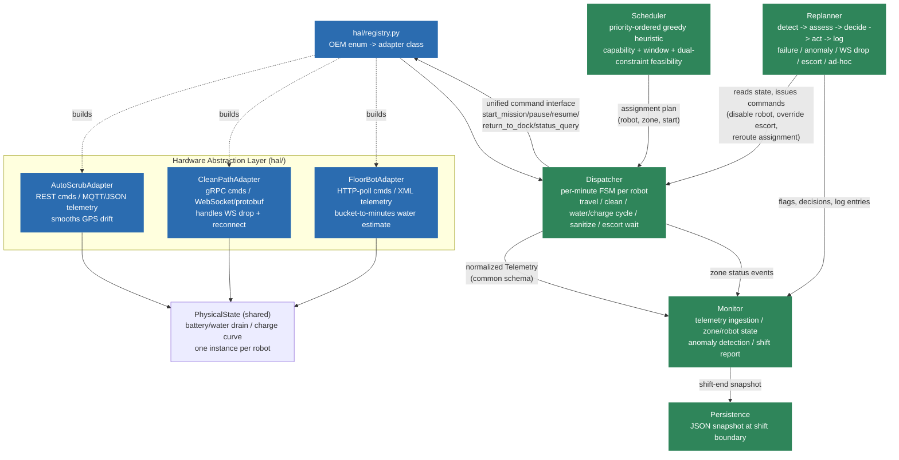

# Multi-OEM Fleet Orchestration System

A fleet orchestrator for a mixed-OEM fleet of 8 cleaning robots (AutoScrub,
CleanPath, FloorBot) operating at Regional General Hospital, built for the
AI Lead Engineer homework assignment. Everything below -- HAL, scheduler,
dispatcher, monitor, replanner, robot simulator -- is a working Python
simulation you can run today with no external services.

For design decisions, assumptions, and tradeoffs, see **[SPEC.md](SPEC.md)**.

## Quick start

```bash
python main.py                          # run the Tuesday night shift, full narrative + shift report
python main.py --quiet                   # only print the final shift report + dashboard
python main.py --save data/shift.json    # also persist fleet/zone/consumable state to disk
python main.py --load data/shift.json    # print a previously saved shift's state
python -m unittest tests.test_basic -v   # run the test suite (15 tests)
```

No dependencies beyond the Python 3.10+ standard library.

## Visual demo (browser)

`visualizer/index.html` is a standalone, self-contained 2D simulation you
can just open in a browser (no server, no build step) — a schematic bird's
eye floor plan where zones paint from red to green as robots clean them,
live battery/water bars per robot (including FloorBot's uncertain bucket
reading), a real-time clock across the 19:00-07:00 shift, and two
one-click disruptions (the R-003 sensor fault, the ad-hoc Z1 request).

**This is a separate, simplified JavaScript simulation** with its own
scheduler/physics for visualization purposes — it is not a replay of the
Python system's actual output, and its numbers won't match a given
`main.py` run exactly. It demonstrates the same concepts (dual battery+water
constraints, capability-gated zones, real-time re-planning) for a reader
who wants to *see* the mechanism rather than read a shift report.

## What it simulates

A per-minute discrete-event simulation of the 19:00-07:00 shift described in
the assignment: schedule generation, all 8 robots physically operating
(battery/water drain, travel, charging, sanitization), and the full
disruption timeline -- the ad-hoc Main Lobby request (7b), the R-003
sensor fault, the R-008 water anomaly, the R-005 WebSocket drop, and the
Z5 security escort delay. Two of those (R-001's water-empty stop on Z1,
and R-008's routine charge/water cycles at the garage) emerge **organically**
from the physics; the rest are injected at a scripted sim-time the way a
live event feed would deliver them. See `fleet_orchestrator/scenario.py`.

## Architecture



**The one rule that keeps this extensible:** everything left of the HAL
box only ever sees the 5-command interface and the normalized `Telemetry`
schema. Scheduler, Dispatcher, Monitor, and Replanner never import
`autoscrub.py`, `cleanpath.py`, or `floorbot.py` directly -- only
`hal/registry.py` does. **Adding a 4th OEM is writing one adapter file and
adding one line to the registry's lookup table** (verified by
`tests/test_basic.py::test_fourth_oem_is_a_pure_addition`).

### Module map

| Module | Responsibility |
|---|---|
| `fleet_orchestrator/models.py` | Common data model + the normalized `Telemetry` schema |
| `fleet_orchestrator/facility.py` | Hospital zones, fleet roster, capability/eligibility rules |
| `fleet_orchestrator/hal/` | `base.py` (interface + shared physics), one adapter per OEM, `registry.py` (factory) |
| `fleet_orchestrator/scheduler.py` | Nightly assignment plan generator (the heuristic, with objective function documented in the module docstring) |
| `fleet_orchestrator/dispatcher.py` | Per-minute FSM that executes the plan and reacts to physics in real time |
| `fleet_orchestrator/monitor.py` | Telemetry ingestion, fleet/zone dashboards, anomaly detection, shift report |
| `fleet_orchestrator/replanner.py` | The 5 disruption handlers (detect -> assess -> decide -> act -> log) |
| `fleet_orchestrator/persistence.py` | JSON state snapshot/restore across restarts |
| `fleet_orchestrator/scenario.py` | The scripted Tuesday-night simulation (schedule + disruption timeline) |
| `main.py` | CLI entrypoint |
| `tests/test_basic.py` | HAL normalization, scheduler eligibility, dual-constraint, replanner tests |

## Sample output (abridged)

```
7:00 PM -- Orchestrator generates tonight's schedule (Tuesday)
  R-001  -> Z1 [primary  ] planned_start=21:00 est=150 min
  R-003  -> Z7 [primary  ] planned_start=23:00 est=29 min
  R-003  -> Z5 [primary  ] planned_start=01:00+1d est=85 min
  ...

--- 10:30 PM: R-008 reports water 'low' only ~20 min after refilling ---
--- 12:30 AM: AD-HOC REQUEST -- facility manager wants Z1 cleaned 2:00-3:00 AM ---
    result: FULL coverage achievable (~22000 ft^2)
--- 2:15 AM: R-003 (AS-900H) sensor fault, only sterile-certified robot goes offline ---

SHIFT REPORT -- Regional General Hospital -- 19:00 to 07:00
-- Zone Outcomes --
  Z1 Main Lobby             COMPLETE       (100% coverage) *** SLA ZONE ***
  Z2 ED Hallways            MISSED         *** SLA ZONE ***
  ...
-- Consumable Tracking (per robot) --
  R-001: water_cycles=1 charge_cycles=1 binding_constraint=water
  ...
```

Run `python main.py` for the full narrative and report.

## Design decisions & tradeoffs

Kept out of this README on purpose -- see **[SPEC.md](SPEC.md)** for the
full discussion of: the objective function, why the scheduler is a greedy
heuristic instead of an ILP solver, the FloorBot water-uncertainty policy
(conservative vs. aggressive), scripted vs. emergent disruptions, the
persistence granularity tradeoff, why no LLM component was used, and every
place the assignment brief was ambiguous and what assumption was made.
