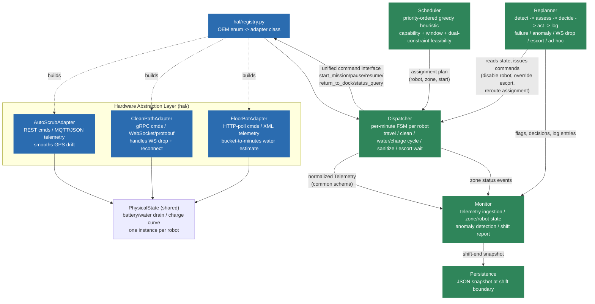

# Multi-OEM Fleet Orchestration System

## How this system approaches the problem

**The core idea: separate "what should happen" from "what is actually
happening."** A night shift has two very different problems bundled
together — planning who cleans what, and reacting to a physical robot
running low on water at 11:47 PM. Trying to solve both with one component
(a single upfront schedule that also predicts every break down to the
minute) means the plan goes stale the moment anything real-world happens —
an escort delay, a dropped connection, a sensor glitch. So this system
splits into two halves that hand off to each other:

- A **Scheduler** that, once at 7:00 PM, looks at the zone list and the
  fleet and produces a rough plan: who cleans what, roughly when, checked
  for basic feasibility (does this robot fit its window with some margin
  to spare). It does *not* try to predict the exact minute a robot will
  need a water break — that's unknowable in advance.
- A **Dispatcher** that then runs the shift minute-by-minute against real
  simulated physics (battery drain, water drain, travel, charging) and
  inserts a break exactly when the robot's own telemetry says it needs
  one. This is what actually enforces the dual battery+water constraint,
  in real time, rather than the schedule guessing at it upfront.

This plan/execute split is the single biggest design decision in the
system, and it's why the rest holds up under disruption: a scripted event
(a WebSocket drop, a sensor fault, an ad-hoc request from the facility
manager) only ever has to update *live state*, never invalidate a
precomputed timeline.

**Scheduling and routing approach.** Zones aren't treated as equally
important — a missed sterile OR corridor is categorically worse than a
missed supply closet, so the scheduler ranks Sterile > High-traffic >
Standard, then by earliest window close, and only adds a second robot to
a zone when one robot would leave under 20% slack against its deadline
(real risk of not finishing, not just "could go faster"). This is a
**greedy, priority-ordered heuristic**, not a constraint solver (ILP/CP-SAT).
For 8 robots × 8 zones a real solver would find a provably optimal
assignment in milliseconds, and in a production system that's arguably the
right call — but the heuristic is a ~40-line function anyone can read
top-to-bottom and reason about by hand, and since the Dispatcher (not the
Scheduler) is the actual source of truth for break timing, the scheduler
only needs to prove a plan is *plausible*, which shrinks the problem
considerably. The tradeoff: a heuristic can leave value on the table (a
better swap two zones over that it never considers) — a rounding error at
this scale, but it would not hold up at hundreds of zones without a real
solver.

**How the dual constraint (battery + water) is actually handled.** Every
simulated minute, the Dispatcher checks both battery and water level and
records *which one* would force a return to dock first. Measured directly
across 140 simulated shifts (see `analysis/binding_constraint_study.py`):
water is the binding constraint 100% of the time in this fleet — every
wet robot's water tank is undersized relative to its battery (a 90-minute
tank against a 180-240 minute battery), so no scheduling strategy changes
that ratio. That empirical finding is *why* the objective function treats
water stops as the real secondary cost to optimize around, instead of
battery.

**How disruptions and adaptation work.** A separate **Replanner** module
handles the five required disruption types, each following the same
loop: detect → assess → decide → act → log. Some disruptions emerge
organically from the physics simulation itself (a robot's tank running dry
mid-clean); others (a sensor fault, a dropped connection, a security
escort delay, an ad-hoc cleaning request) are injected the way a real
system would receive them — an external event hitting a live orchestrator
— and are handled by generic handler functions that take a robot/zone/time,
not anything demo-specific.

**What changes when adding a new OEM adapter.** Every robot, regardless of
vendor, is only ever touched through five commands (`start_mission`,
`pause`, `resume`, `return_to_dock`, `status_query`) and reports back one
common `Telemetry` shape — the Hardware Abstraction Layer (HAL). All
OEM-specific quirks (a noisy GPS reading, a flaky WebSocket connection, a
coarse 4-bucket water sensor) are handled entirely inside that OEM's own
adapter file and never leak into the scheduler, dispatcher, or monitor.
Concretely, adding a 4th OEM means: **(1)** add its name to the OEM enum,
**(2)** write one new adapter file (a copy-paste template is provided)
that translates that OEM's real behavior into the common Telemetry shape,
**(3)** add one line to the adapter registry, **(4)** add its robots to the
fleet roster. Nothing in the scheduling, dispatch, or monitoring logic
should need to change — a dedicated test enforces this by checking the
registry rather than the scheduler's internals, so a future change can't
quietly reintroduce OEM-specific branching upstream of the HAL.

**Step by step, in plain terms, what actually happens during a shift:**

1. **7:00 PM — Plan.** The Scheduler looks at tonight's zone list (skipping
   zones not scheduled today, like Admin Wing on a Tuesday) and the fleet,
   and assigns each eligible robot to zones in priority order, producing a
   rough timeline for the night.
2. **Robots start moving.** The Dispatcher sends each robot its first
   assignment. A robot travels to its zone, then switches into cleaning
   mode, and its battery/water levels start draining according to real
   physics for that robot's OEM and model.
3. **Breaks happen organically.** As a robot's water or battery gets low,
   the Dispatcher — not a precomputed plan — decides it's time to return to
   the dock, refill water and/or charge (which happen concurrently), and
   redeploy once it's ready (at 90% charge, not a full 100%, since the
   last 10% of a real battery charge is disproportionately slow).
4. **Something unexpected happens.** Whether it's a sensor going haywire, a
   connection dropping, a security escort running late, or the facility
   manager calling in an urgent ad-hoc cleaning request — the Replanner
   detects it, assesses the impact on the current plan, decides on a
   response (reroute, wait, escalate to a human, or accept partial
   coverage), acts on it through the Dispatcher, and logs what happened
   and why.
5. **The Monitor watches throughout.** Every telemetry update is ingested
   continuously — building live dashboards, flagging anomalies (like a
   water reading that doesn't match how long the robot's actually been
   cleaning), and tracking per-zone and per-robot status the whole night.
6. **7:00 AM — Report.** The shift ends, and the Monitor produces a report:
   which zones were fully cleaned, partially cleaned, or missed; how many
   water/charge cycles each robot needed; which constraint bound each
   robot's breaks; and any anomalies or escalations from the night. That
   state can optionally be saved to disk so it survives a restart.

For the full reasoning behind each of these choices — including the
alternatives considered and what they would have cost — see
**[SPEC.md](SPEC.md)**.

## Rubric self-assessment

| Dimension | Weight | Verdict |
|---|---|---|
| OEM Abstraction | 20% | ✅ Clean 5-command interface, quirks fully inside each adapter, 4th OEM is a new file + one line (enforced by a test), telemetry normalized to one schema |
| Scheduling & Dual Constraints | 25% | ✅ Both cycles planned, binding constraint identified and tracked per robot, water stops interleave naturally, FloorBot uncertainty handled conservatively + sharpened with a usage-time model |
| Real-Time Adaptation | 20% | ✅ All 5 disruptions, detect→assess→decide→act→log, R-003 escalates with options (not silently dropped), R-005 WS drop tested both ways (reconnects / never reconnects) |
| Physical-World Reasoning | 15% | ✅ Real (non-linear) battery/charging physics, transport-vs-scrubbing travel speed, full offline-mission handoff protocol, partial completion tracked honestly |
| Fleet Observability | 10% | ✅ Shift report, SLA tracking, consumable tracking, OEM health, anomaly flagging -- extended with learned per-robot ETA and cross-shift degradation/peer-outlier detection |
| Code & Communication | 10% | ✅ 47 automated tests, 6 empirical analysis scripts (not hand-waved claims), 2 architecture diagrams, a browser-based visual demo, 20-section SPEC.md documenting every decision *and* every bug found along the way |

Detail for each dimension, with the specific code it's backed by:

**1. OEM Abstraction.** `hal/base.py::RobotAdapter` is the entire
interface (`start_mission`, `pause`, `resume`, `return_to_dock`,
`status_query`); nothing downstream imports `autoscrub.py`,
`cleanpath.py`, or `floorbot.py` directly, only `hal/registry.py` does.
Every quirk -- AutoScrub's GPS drift smoothing, CleanPath's WebSocket
reconnect logic, FloorBot's coarse-bucket-to-uncertain-estimate
conversion -- lives entirely inside its own adapter file, never leaking
into `scheduler.py`/`dispatcher.py`. `Telemetry` (`models.py`) is the one
common schema every adapter fills in: `robot_id, timestamp, battery_pct,
water_pct(null for dry), position, status, error_codes`. A 4th OEM is a
new adapter file + one registry line, enforced by
`tests/test_basic.py::test_fourth_oem_is_a_pure_addition`, with
`hal/_template_adapter.py` as a ready copy-paste stub. One honest
caveat, stated plainly rather than glossed over: the transport labels
("REST", "gRPC", "HTTP-poll") are metadata, not real protocol
implementations -- within scope per the assignment's own "simulate the
three OEMs" instruction.

**2. Scheduling & Dual Constraints.** `scheduler.py` handles capability/
window feasibility; the actual dual-constraint enforcement happens in
`dispatcher.py` in real time (a deliberate split -- SPEC.md #6).
`wants_return_now()` checks battery *and* water every simulated minute
and returns which one is binding, tracked separately per robot
(`water_bound_stops` vs `battery_bound_stops`) -- empirically measured
across 140 simulated shifts: water binds **100%** of the time in this
fleet, a measured finding (SPEC.md #2), not an assumption, because of the
fleet's 90-min-tank-vs-180-240-min-battery ratio. Water stops interleave
naturally (10-min cycles, concurrent charge+water at the dock). FloorBot's
coarse bucket carries an explicit `water_uncertain=True` flag and a
conservative trigger (return on "low", not "empty" -- SPEC.md #8),
further sharpened by a usage-time model fused with the bucket reading
without changing that safety-relevant trigger (SPEC.md #9, #14).

**3. Real-Time Adaptation.** All 5 disruptions are implemented in
`replanner.py`, each following detect→assess→decide→act→log. R-003:
escalates to a human with 3 explicit options since no sterile backup
exists, marks zones `MISSED-ESCALATED` rather than silently dropping
them. R-008: conservative response (pulled in immediately, doesn't wait
for "empty"), backed by an automatic model-vs-bucket divergence detector
independently validated to catch the same event the scripted trigger
represents (SPEC.md #9/#14). R-005: a 2-minute grace period before
escalating, both outcomes (reconnects in time / never reconnects) covered
by tests.

**4. Physical-World Reasoning.** Battery/water drain via real shared
physics (`PhysicalState`), a non-linear CC/CV charging curve (SPEC.md
#3), a transport-mode-vs-scrubbing-mode travel-speed distinction (SPEC.md
#4), a 15-minute sanitization cycle (a real bug in this was found and
fixed -- SPEC.md #18). The offline-mission handoff is a full protocol:
preloaded waypoints + abort thresholds, autonomous execution with
buffered telemetry, an expected-return ETA, and reconciliation on
reconnect -- and a real bug was found and fixed here too, where buffered
telemetry was counted but never actually fed back into the monitor
(SPEC.md #14). Partial completion is tracked honestly via
`ZoneStatus.PARTIAL` with a real coverage percentage, not silently
rounded up or down.

**5. Fleet Observability.** `Monitor.shift_report()` covers zone
outcomes, SLA tracking, consumable tracking (water/charge cycles +
identified binding constraint per robot), OEM health, and an anomaly log
-- extended with `profile.py`: per-robot ETA to next stop (tagged
`[learned]` once trip history exists, `[spec]` otherwise), cross-shift
degradation detection, and same-OEM/model peer-outlier detection,
validated against two genuinely distinct synthetic fault shapes (an aging
drift and a chronic day-1 defect) with a control robot confirming neither
false-positives (SPEC.md #14).

**6. Code & Communication.** 47 automated tests
(`tests/test_basic.py`), 6 analysis scripts producing real measured
numbers instead of hand-waved claims (`analysis/*.py` -- binding
constraint study, single-day trace, daily tolerance table, consumable
profile demo, facility week report), a mermaid **and** an ASCII
architecture diagram (below), a browser-based visual simulation
(`visualizer/index.html`), and a 20-section `SPEC.md` documenting every
design decision, every assumption, and every bug found and fixed along
the way -- including the ones that were embarrassing to admit, like a
sanitization cycle silently skipping the first zone of every shift.

---

A fleet orchestrator for a mixed-OEM fleet of 8 cleaning robots (AutoScrub,
CleanPath, FloorBot) operating at Regional General Hospital, built for the
AI Lead Engineer homework assignment. Everything below -- HAL, scheduler,
dispatcher, monitor, replanner, robot simulator -- is a working Python
simulation you can run today with no external services.

For design decisions, assumptions, and tradeoffs, see **[SPEC.md](SPEC.md)**.

## Setup

Requires **Python 3.10+**, nothing else — no `pip install`, no external
services, no API keys. Clone and run:

```bash
git clone https://github.com/omarkhawaja/RoboticCleanerOrchestartion.git
cd RoboticCleanerOrchestartion
python main.py
```

## Running the simulation

```bash
python main.py                          # run the Tuesday night shift, full narrative + shift report
python main.py --quiet                   # only print the final shift report + dashboard
python main.py --save data/shift.json    # also persist fleet/zone/consumable state to disk
python main.py --load data/shift.json    # print a previously saved shift's state
python main.py --profile-db data/profile.json   # accumulate a cross-shift consumable profile (re-run to build history)
```

## Testing / verifying the system against the spec

```bash
python -m unittest tests.test_basic -v   # full test suite (47 tests)
python -m pytest tests/ -v               # same suite, if pytest is installed
```

The test suite is the actual verification harness — it checks the system
against the assignment's given data and constraints directly, not just
"does it run": `TestFacilitySpecMatchesImage` locks in every zone's
sqft/floor/classification/window/day-pattern against the facility spec
field by field; `TestScheduler`/`TestSanitization`/`TestDualConstraint`
verify capability gating, the AS-900H sanitization cycle, and the
battery/water dual-constraint; `TestReplanner` exercises all 5 disruption
handlers, including both outcomes of the R-005 WebSocket-drop grace
period; `TestChargingCurve`/`TestTransportModeTravel`/
`TestFloorBotWaterEstimator`/`TestConsumableProfile` cover the physics and
learned-profiling additions. No test touches the network or a real
service — the whole suite runs in well under a second.

To "deploy" this for a live walkthrough there's nothing to provision —
it's a CLI. The closest thing to a deploy step is opening the standalone
browser demo (next section), which is just a static HTML file.

**Empirical/analysis scripts** (each runs many simulated shifts and
prints real measured numbers, not hand-waved claims — see SPEC.md for
what each one found):

```bash
python -m analysis.binding_constraint_study     # 140 shifts: is water or battery the real bottleneck?
python -m analysis.single_day_trace             # one full shift, minute-by-minute event trace
python -m analysis.daily_tolerance_table 28      # N consecutive days: schedule slack per day
python -m analysis.facility_week_report          # Mon-Sun: the facility table + weekly summary (see below)
python -m analysis.consumable_profile_demo       # 20 shifts, synthetic aging/chronic-fault injection
```

## Visual demo (browser)

**File:** [`visualizer/index.html`](visualizer/index.html) — after
cloning, open it directly (`file://` works, no server needed):

```bash
# macOS
open visualizer/index.html
# Linux
xdg-open visualizer/index.html
# Windows
start visualizer/index.html
```

GitHub's file viewer only shows the source, not a live page — it has to
be opened locally, or served from GitHub Pages if you want a shareable
link.

A standalone, self-contained 2D simulation — a schematic bird's
eye floor plan where zones paint from red to green as robots clean them,
live battery/water bars per robot (including FloorBot's uncertain bucket
reading), a real-time clock across the 19:00-07:00 shift, and two
one-click disruptions (the R-003 sensor fault, the ad-hoc Z1 request).
**"Run Full Week"** drives the same engine headlessly across all 7 real
weekdays (Z4 only Mon/Wed/Fri, Z8 only Tue/Sat, per the facility's actual
cleaning-day pattern) and renders a results table: zones scheduled,
cleaned %, time taken, allocated capacity, and the delta/tolerance for
each night.

**This is a separate, simplified JavaScript simulation** with its own
scheduler/physics for visualization purposes — it is not a replay of the
Python system's actual output, and its numbers won't match a given
`main.py` run exactly. It demonstrates the same concepts (dual battery+water
constraints, capability-gated zones, real-time re-planning) for a reader
who wants to *see* the mechanism rather than read a shift report.

Two real bugs were caught and fixed while building the week mode (worth
naming, since they'd otherwise have quietly undercut the demo): the
escort-wait "randomness" was keyed only by robot+time-of-night, not by
day, so every night played out identically; and the dock-service phase
counted down the correct duration without ever actually applying the
battery/water gain, so a robot would sit at the dock the right number of
minutes and leave exactly as depleted as it arrived. Fixing both took
facility-wide weekly coverage from ~65% to a genuine 100% across all 7
nights, matching the Python engine's own findings qualitatively (positive
schedule slack every night, no zone structurally starved).

## What it simulates

A per-minute discrete-event simulation of the 19:00-07:00 shift described in
the assignment: schedule generation, all 8 robots physically operating
(battery/water drain, travel, charging, sanitization), and the full
disruption timeline -- the ad-hoc Main Lobby request (7b), the R-003
sensor fault, the R-008 water anomaly, the R-005 WebSocket drop, and the
Z5 security escort delay. Two of those (R-001's water-empty stop on Z1,
and R-008's routine charge/water cycles at the garage) emerge **organically**
from the physics; the rest are injected at a scripted sim-time the way a
live event feed would deliver them. See `fleet_orchestrator/scenario.py`.

## Where things live, and what to touch when

The short version: **`facility.py` is the assignment's data, `hal/base.py`
is the physics, `scenario.py` is the demo script, everything else is
orchestration logic you shouldn't need to touch for a routine change.**

### "I need to add a new OEM / robot adapter"

1. Add the OEM name to `models.OEM` (one enum line).
2. Copy [`hal/_template_adapter.py`](fleet_orchestrator/hal/_template_adapter.py)
   to `hal/<oem_name>.py`, rename the class, fill in `status_query()` (and
   `tick()` only if this OEM has a per-minute quirk like a dropout timer).
3. Register it in [`hal/registry.py`](fleet_orchestrator/hal/registry.py)'s
   `_ADAPTERS` dict (one line).
4. Add a `RobotSpec` for it to `facility.build_fleet()` in `facility.py`.

Nothing in `scheduler.py`, `dispatcher.py`, or `monitor.py` should need to
change — if it does, the adapter is leaking OEM-specific detail past the
HAL boundary. `tests/test_basic.py::test_fourth_oem_is_a_pure_addition`
enforces this.

### "I need to add/change facility requirements" (zones, windows, fleet size)

Edit **`facility.py`** only:
- New/changed zone (sqft, floor type, classification, window, days,
  WiFi) → `build_zones()`.
- New/changed robot (OEM, model, coverage rate, battery/water hours,
  capabilities) → `build_fleet()`.
- New eligibility rule (e.g. a new floor type or classification) →
  `can_clean()` / `wants_wet_scrub()` in the same file.

This is the **only** file that hardcodes the assignment's numbers —
everything downstream (scheduler, dispatcher, monitor) is generic over
whatever zone/robot list it's handed, so a facility change here doesn't
require touching orchestration logic.

### "I need to add/change a physical constraint" (timing, charging, travel cost)

Edit **`hal/base.py`** — it's the single shared "ground truth physics"
engine every OEM adapter wraps (`PhysicalState`, plus module-level
constants: `TRAVEL_MINUTES`, `WATER_CYCLE_MINUTES`, `SANITIZE_MINUTES`,
the CC/CV charging curve). Dispatch-*policy* thresholds that react to that
physics (when a robot is forced back to dock, when escort is required)
live in **`dispatcher.py`** instead (`BATTERY_RETURN_PCT`,
`ESCORT_ZONE_HOUR_START`) — physics vs. policy is the dividing line
between these two files.

### Files you'll rarely (or never) need to touch

- **`models.py`** — the shared schema (`Telemetry`, `Zone`, `RobotSpec`,
  enums). Touching it affects every downstream file, so change it only
  for a genuinely new cross-cutting field/status, not a one-off need.
- **`hal/_template_adapter.py`** — intentionally not imported by
  anything; it's a copy-paste stub, never a place to add real behavior.
- **`scenario.py`** — the *specific* scripted Tuesday-night demo
  (timing of each disruption for the sample walkthrough). Edit this only
  if you want a different demo narrative or day, not for facility/physics
  changes — those belong in `facility.py` / `hal/base.py` respectively.
- **`data/*.json`** — generated output from `--save`/`--profile-db` runs,
  gitignored. Never hand-edit; regenerate by re-running `main.py`.
- **`tests/test_basic.py`** — update when you *intentionally* change
  behavior it covers (e.g. a new facility number); never edit a test just
  to make a real regression pass.

### Full module reference

| Module | Stores / does | Edit when |
|---|---|---|
| `models.py` | Common schema: `Telemetry`, `Zone`, `RobotSpec`, enums | Adding a cross-cutting field/status every layer needs |
| `facility.py` | Zones, fleet roster, capability rules | Facility or fleet requirements change |
| `hal/base.py` | 5-command adapter interface + shared physics (`PhysicalState`) + physical constants | Adding/changing a physical constraint |
| `hal/autoscrub.py`, `cleanpath.py`, `floorbot.py` | One OEM-specific quirk each (GPS drift, WS reconnect, water-bucket fusion) — nothing else | Modeling a new OEM-specific reporting quirk |
| `hal/registry.py` | OEM enum → adapter class map | Registering a new OEM adapter |
| `hal/_template_adapter.py` | Copy-paste stub, not wired in | Never edit directly — copy it |
| `scheduler.py` | Greedy heuristic that builds the nightly plan | Changing the objective function / prioritization |
| `dispatcher.py` | Per-minute FSM that executes the plan; dispatch-policy thresholds | Changing dispatch policy (return-to-dock floor, escort hour) or FSM behavior |
| `monitor.py` | Telemetry ingestion, dashboards, anomaly detection, shift report | Adding observability or changing anomaly thresholds |
| `profile.py` | Cross-shift learned consumption rates, degradation/peer-outlier detection | Changing how learned rates are computed/persisted |
| `replanner.py` | The 5 disruption handlers | Adding/changing a disruption type |
| `persistence.py` | JSON save/load of shift state | Changing what's persisted or the storage format |
| `scenario.py` | The scripted Tuesday-night demo timeline | Changing the demo narrative/day, not facility/physics data |
| `main.py` | CLI entrypoint | Adding a CLI flag |
| `analysis/*.py` | Standalone measurement scripts (not imported by the app) | Adding a new empirical study |
| `tests/test_basic.py` | Regression tests | Behavior intentionally changes |
| `SPEC.md` | Rationale for every deliberate design decision | A new decision worth documenting is made |

## Architecture



**The one rule that keeps this extensible:** everything left of the HAL
box only ever sees the 5-command interface and the normalized `Telemetry`
schema. Scheduler, Dispatcher, Monitor, and Replanner never import
`autoscrub.py`, `cleanpath.py`, or `floorbot.py` directly -- only
`hal/registry.py` does. **Adding a 4th OEM is writing one adapter file and
adding one line to the registry's lookup table** (verified by
`tests/test_basic.py::test_fourth_oem_is_a_pure_addition`). See
`hal/_template_adapter.py` for a copy-paste starting point -- a stub with
`NotImplementedError` bodies and a quirk-handling checklist at each spot
an OEM's real behavior would go.

### ASCII version (file layout + import graph, for anything that can't render mermaid)

```
fleet_orchestrator/
|
|-- models.py                  [foundation -- no internal imports]
|       Zone, RobotSpec, OEM, RobotStatus, ZoneStatus, Telemetry
|       (the common schema every other file shares)
|
|-- facility.py                --> models.py
|       zones + fleet roster, can_clean() / wants_wet_scrub()
|
|-- hal/
|   |-- base.py                --> models.py
|   |       RobotAdapter ABC (5-command interface) + PhysicalState
|   |       (shared battery/water/charge-curve physics)
|   |
|   |-- autoscrub.py           --> base.py, models.py
|   |-- cleanpath.py           --> base.py, models.py
|   |-- floorbot.py            --> base.py, models.py
|   |       three concrete adapters, one per OEM -- each owns its own
|   |       quirk (GPS drift / WS reconnect / water-bucket + usage-time
|   |       fusion) and nothing else in the codebase touches them directly
|   |
|   |-- registry.py            --> base.py, autoscrub.py, cleanpath.py,
|   |                               floorbot.py, models.py
|   |       OEM enum -> adapter class factory -- the ONLY file that
|   |       knows all three (soon four) adapters exist
|   |
|   |-- _template_adapter.py   --> base.py, models.py
|   |       (NOT wired into registry.py -- copy-paste stub for OEM #4)
|   |
|   `-- __init__.py            re-exports base.py + registry.py
|
|-- scheduler.py               --> facility.py, hal/base.py, models.py
|       greedy heuristic: capability + window + dual-constraint
|       feasibility -> per-robot Assignment queue
|
|-- profile.py                 --> models.py   [ONLY -- deliberately
|       trip segmentation, ProfileStore,         generic over telemetry,
|       learned rates, degradation +             no OEM/dispatcher import]
|       peer-outlier detection
|
|-- dispatcher.py              --> hal/base.py, models.py, scheduler.py
|       RobotController (per-robot FSM) + FleetDispatcher (steps the
|       whole fleet minute-by-minute, talks to robots ONLY via hal/)
|
|-- monitor.py                 --> models.py, profile.py
|       telemetry ingestion, ETA, anomaly detection, dashboards, shift
|       report -- never imports an OEM module or dispatcher.py
|
|-- replanner.py               --> facility.py, hal/base.py, models.py,
|       5 disruption handlers       scheduler.py
|       (detect -> assess -> decide -> act -> log)
|
|-- persistence.py             --> models.py
|       JSON snapshot/restore at shift boundaries
|
`-- scenario.py                --> facility.py, replanner.py, dispatcher.py,
        wires it all together,      hal/registry.py, models.py, monitor.py,
        scripted Tuesday-night      profile.py, scheduler.py
        timeline

main.py                        --> persistence.py, profile.py, scenario.py
    CLI entrypoint

analysis/*.py  (5 scripts)     --> facility.py, replanner.py, dispatcher.py,
    standalone measurement          hal/registry.py, monitor.py, profile.py,
    scripts -- call the same        scheduler.py
    modules directly, skip
    scenario.py's scripted
    disruption timeline for
    clean baseline numbers

--------------------------------------------------------------------------
RUNTIME DATA FLOW (who actually talks to whom while a shift runs --
dispatcher/monitor/replanner are handed to each other as live objects,
not import-linked, so this isn't visible from the import graph alone):

  scheduler.py    --(Assignment queue)-->        dispatcher.py
  dispatcher.py   --(RobotAdapter commands)-->    hal/*.py
  hal/*.py        --(normalized Telemetry)-->     dispatcher.py
  dispatcher.py   --(Telemetry, every tick)-->     monitor.py
  monitor.py      <--(learned rate / flags)-->     profile.py
  replanner.py    --(reads state, issues cmds)-->  dispatcher.py
  replanner.py    --(flags, decisions, log)-->     monitor.py
  scenario.py     --(record_shift)-->              profile.py --> disk (JSON)
  monitor.py      --(shift_report/dashboard)-->    scenario.py / main.py --> terminal
--------------------------------------------------------------------------
```

### Module map

| Module | Responsibility |
|---|---|
| `fleet_orchestrator/models.py` | Common data model + the normalized `Telemetry` schema |
| `fleet_orchestrator/facility.py` | Hospital zones, fleet roster, capability/eligibility rules |
| `fleet_orchestrator/hal/` | `base.py` (interface + shared physics), one adapter per OEM, `registry.py` (factory), `_template_adapter.py` (copy-paste stub for a 4th OEM) |
| `fleet_orchestrator/scheduler.py` | Nightly assignment plan generator (the heuristic, with objective function documented in the module docstring) |
| `fleet_orchestrator/dispatcher.py` | Per-minute FSM that executes the plan and reacts to physics in real time |
| `fleet_orchestrator/monitor.py` | Telemetry ingestion, fleet/zone dashboards, ETA-to-next-stop, anomaly detection, shift report |
| `fleet_orchestrator/profile.py` | Cross-shift consumable profiling: trip-normalized rates, learned ETA, degradation + peer-outlier detection |
| `fleet_orchestrator/replanner.py` | The 5 disruption handlers (detect -> assess -> decide -> act -> log) |
| `fleet_orchestrator/persistence.py` | JSON state snapshot/restore across restarts |
| `fleet_orchestrator/scenario.py` | The scripted Tuesday-night simulation (schedule + disruption timeline) |
| `main.py` | CLI entrypoint (`--profile-db PATH` to accumulate a cross-shift profile store) |
| `tests/test_basic.py` | HAL normalization, scheduler eligibility, dual-constraint, replanner, consumable-profile tests |

## Sample output (abridged)

```
7:00 PM -- Orchestrator generates tonight's schedule (Tuesday)
  R-001  -> Z1 [primary  ] planned_start=21:00 est=150 min
  R-003  -> Z7 [primary  ] planned_start=23:00 est=29 min
  R-003  -> Z5 [primary  ] planned_start=01:00+1d est=85 min
  ...

--- 10:30 PM: R-008 reports water 'low' only ~20 min after refilling ---
--- 12:30 AM: AD-HOC REQUEST -- facility manager wants Z1 cleaned 2:00-3:00 AM ---
    result: FULL coverage achievable (~22000 ft^2)
--- 2:15 AM: R-003 (AS-900H) sensor fault, only sterile-certified robot goes offline ---

SHIFT REPORT -- Regional General Hospital -- 19:00 to 07:00
-- Zone Outcomes --
  Z1 Main Lobby             COMPLETE       (100% coverage) *** SLA ZONE ***
  Z2 ED Hallways            MISSED         *** SLA ZONE ***
  ...
-- Consumable Tracking (per robot) --
  R-001: water_cycles=1 charge_cycles=1 binding_constraint=water
  ...
```

Run `python main.py` for the full narrative and report.

## Design decisions & tradeoffs

Kept out of this README on purpose -- see **[SPEC.md](SPEC.md)** for the
full discussion of: the objective function and the 140-shift empirical
study backing it (water binds 100% of the time, battery never does), the
non-linear CC/CV charging curve and the redeploy-at-90% dispatch policy it
justifies, the transport-mode-vs-scrubbing-mode travel speed distinction
for dock-service legs (both measured, +27% fleet-wide schedule slack
combined), the FloorBot usage-time water estimator that fuses the coarse
bucket reading with a continuous usage-time model without changing the
safety-relevant return-trigger policy, the cross-shift consumable-profile
system (trip-normalized rates, learned ETA, degradation and same-OEM/model
peer-outlier detection -- validated against two distinct synthetic fault
shapes in `analysis/consumable_profile_demo.py`), why the scheduler is a
greedy heuristic instead of an ILP solver, the FloorBot water-uncertainty
policy (conservative vs. aggressive), scripted vs. emergent disruptions,
the persistence granularity tradeoff, why no LLM component was used, and
every place the assignment brief was ambiguous and what assumption was
made.
